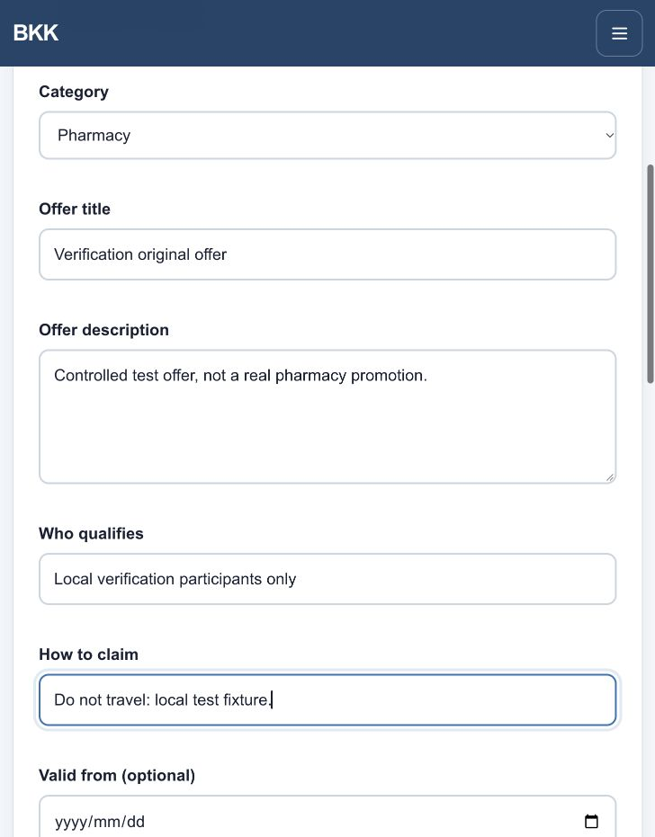
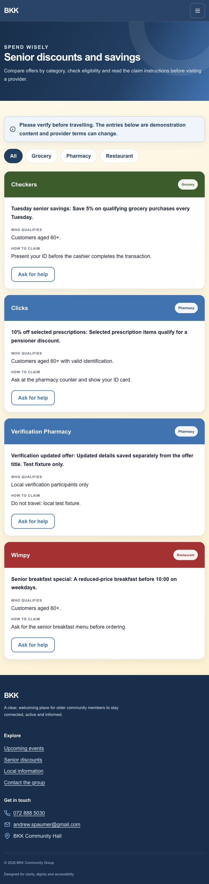
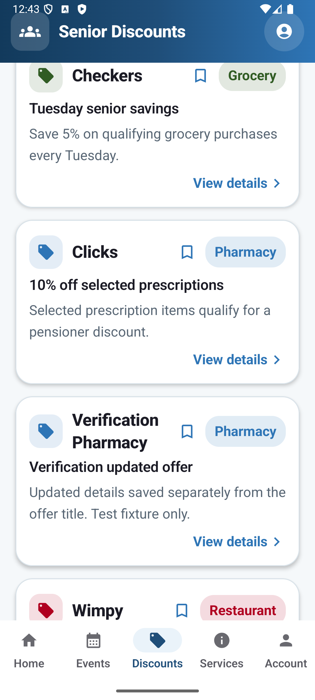
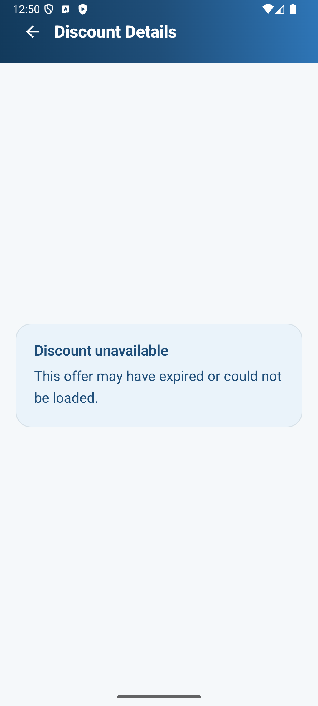
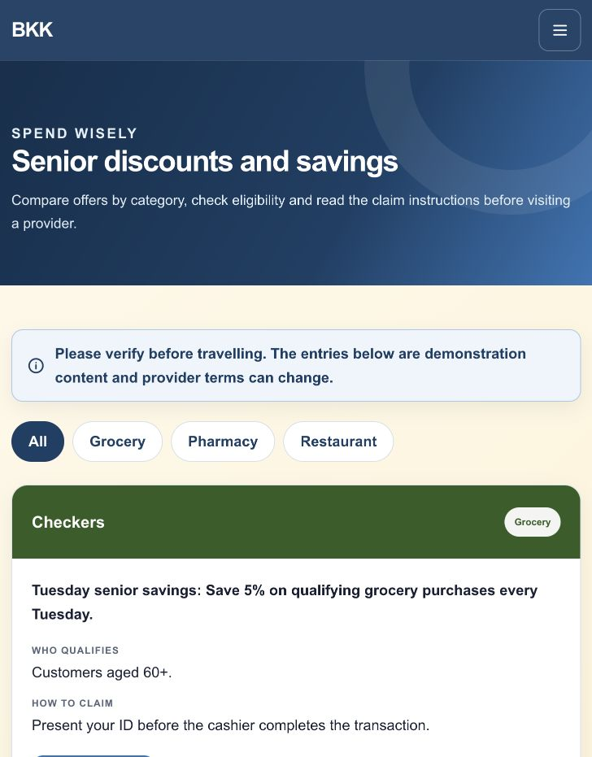
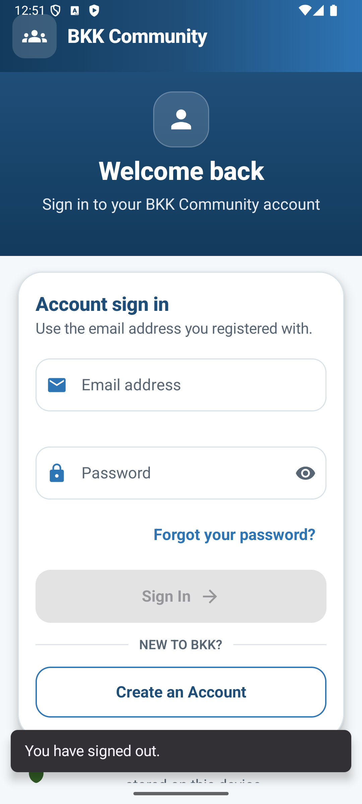

# Android and website verification — 1 October 2026

## Outcome and scope

The active project now contains the Android app, website, administrator pages and shared PHP/MySQL API. Native iOS source has been removed from the current tree and preserved in a separate local recovery archive. Dated audit reports and submitted documents remain historical records; their earlier platform references are not current delivery claims.

These changes are verified locally on the branch `fix/android-web-scope-and-admin-sync`. They are not automatically deployed by this report. Read-only production checks were performed against `https://bkkcommunity-platform-2-production.up.railway.app`; the observed server commit was `7c8e3392e41fec05a8855c59ed262596eeec5816`.

## What was corrected

Discount administration now stores the offer title independently of its description. Previously editing an offer could overwrite the title with description text.

Android reads the three content endpoints concurrently, then replaces the Room cache atomically only after all reads succeed. Failed reads preserve the previous content and last-successful-update timestamp. Refresh runs at startup, after sign-in, on return to the foreground and through the manual Refresh action. It is not a continuously streaming real-time connection.

A successful empty response is now retained as empty content: an offline restart cannot restore deleted demo records. Successful refresh also clears old detail fallbacks, so an archived event or discount cannot remain visible through a stale detail snapshot.

Current setup, architecture, feature and testing documents were narrowed to Android and website scope. MySQL integration tests were added to the GitHub quality-gate configuration; a hosted run of the changed workflow is separate evidence from the local executions below.

## Executed checks

PHP syntax checks, Composer validation and the web smoke suite passed. The three MySQL-backed suites passed against an isolated MySQL 9.7.1 database initialized from the canonical schema and all seven numbered migrations. The added CI job targets MySQL 8.0, but its hosted execution is not claimed here.

The admin suite checked login, contact-message management, event editing and stale-update rejection, independent discount title/details, category filters, service edits, archives/restores, expiry filtering, audit history and administrator-role revocation. It confirmed that admin content changes were returned by both public website pages and the JSON endpoints used by Android.

The member and API suites checked registration, authentication, profile updates, unique RSVP/cancellation, history, contact validation, notification preferences, unique device-token storage, session revocation and account deletion. Password-reset checks used an injected local reset-code hash to exercise consumption, five-attempt lockout and session revocation. They do **not** prove email delivery.

Android unit tests, lint and debug assembly passed. Six unit tests and eleven instrumentation tests passed. The instrumentation suite ran on both API 26 and API 36 ARM64 emulators. Its five new cache tests cover content edits, archive removal, all-or-nothing offline refresh, failed RSVP without false success, and an offline restart after an authoritative empty response. The other tests cover the login gate, recovery/registration navigation, home presentation and feature persistence.

A separate end-to-end UI check used the actual local PHP/MySQL service and Android app, not a mocked repository. A labelled verification offer was created and edited through the admin website. Android displayed the edit after leaving and returning to the app without pressing Refresh. Archiving the offer removed it from the website, the Android list and the already-open Android detail screen.

The Android logout journey also passed: after logging out from Account, the app returned to the login screen and stayed gated after leaving and returning.

Composer's locked-dependency audit reported no security vulnerability advisories at the time of execution. This is not an independent penetration test or proof that all security risks are absent.

Production readiness returned `database: connected`. Public event data was empty; three discount and three service records were readable. The website labels its offers as demonstration content. HTTPS responses included HSTS, CSP, frame denial, MIME sniffing protection, referrer policy and restricted browser permissions. Current authenticated production writes were not exercised.

## Evidence files and screenshots

The logs are execution records, not manual UAT results:

- [Web smoke](web-smoke.log), [PHP syntax](php-syntax.log), [Composer audit](composer-audit.log).
- [Admin/database propagation](admin-integration.log), [member workflows](member-integration.log), [API/security boundaries](api-integration.log).
- [Final Android build/unit/lint/both-emulator verification](android-final-verification.log), [final API 26 JUnit XML](android-final-api26-tests.xml), [final API 36 JUnit XML](android-final-api36-tests.xml), [lint report](android-lint.xml).
- XML UI journeys and their JSON results are stored alongside screenshots; their definitions and reusable ADB runner are in `apps/android/tests`. Test inputs are redacted in reports.

### Actual local admin form

This is a disposable, clearly labelled test offer, not an authentic pharmacy promotion.

### Public website after the admin edit

The updated offer is visible under Verification Pharmacy; title and description remain distinct.

### Android after foreground refresh

The same edited title is visible in Android after the app resumes.

### Open Android details after archive

The stale offer cannot be recovered from a detail fallback after a successful refresh.

### Production website

This screenshot is from the deployed website and is intentionally separate from the local propagation evidence above.

### Android after logout

## Test-environment issues

An early UI assertion used a curly apostrophe for a heading rendered with a straight apostrophe and also expected a below-fold heading to be visible. Execution stopped at that assertion. The corrected journey verifies a genuinely visible home heading and explicitly scrolls before checking an offer.

The API 26 emulator had an older debug build signed with a different key. Its APK and app data were archived locally before reinstalling the current test build. No physical phone was reset.

iCloud introduced duplicate/offloaded generated DEX files during an incremental rebuild. Building generated output outside the synced Documents directory resolved the failure. The optional `BKK_BUILD_ROOT` environment variable supports this workaround without committing a machine-specific path.

## What this does not prove

This is not a claim that every screen/state combination or every possible defect has been tested. Current production admin CRUD, production backup/restore, actual reset-email receipt, real FCM delivery, physical-device behaviour, TalkBack, complete 200% font-scale coverage, elderly-user UAT and client/legal acceptance remain separate checks.

The shared testing APK uses the Railway HTTPS API, not the local test server. It is a debug-signed test build, not a signed production release. Anyone who already has an APK signed by another developer may need to uninstall that older build, which removes its local data; back up anything needed first.

The APK passed signature verification and ZIP integrity checking. Its SHA-256 is `71318b3beaa1c57a82215b1f6f18a4b5daf8b651cc2bd652fe705d7409ad45a4`.

The screenshot fixtures do not make Checkers, Clicks or Wimpy offers authentic. Approved provider information and an agreed process for maintaining it are still required before the platform can be presented as a live community service.
